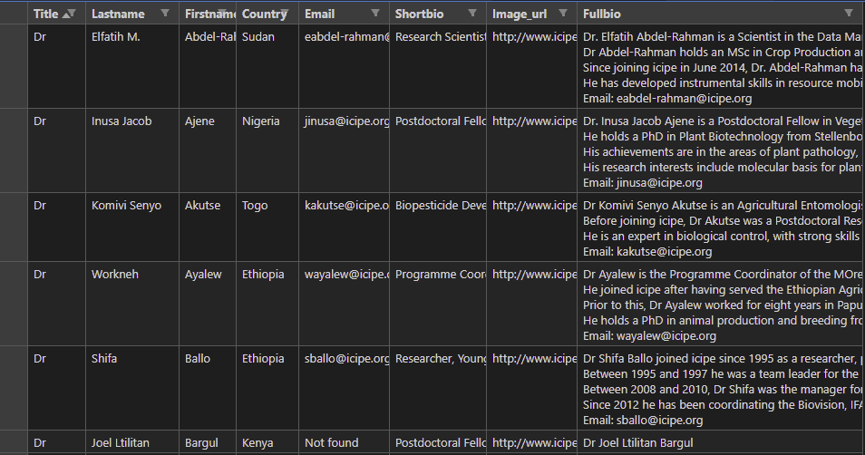

# Institution Web Scraping

## About
A python bot that scrapes the staff data from [icipe website](http://www.icipe.org/about/staff) and saves to a csv file. The program extracts the following for each staff:
* Title
* Firstname
* Lastname
* Country
* Email
* Short bio
* Full bio

## Usage
### Prerequisites
**Python** 
``` 
https://www.python.org/
```
**Selenium** 
```
pip install selenium 
```
**Chrome web driver**
* Check your chrome version
```
chrome://version
 ```
*  Download the chrome driver matching your version
 ```
 https://chromedriver.chromium.org/downloads
 ```
### Steps
1. Clone this repository
   ```
   git@github.com:ckigenk/Institution-web-scrapping.git
   ```
2. Execute [main.py](https://github.com/ckigenk/Institution-web-scrapping/blob/main/main.py) file
   ```
   python main.py
   ```
## Sample output
